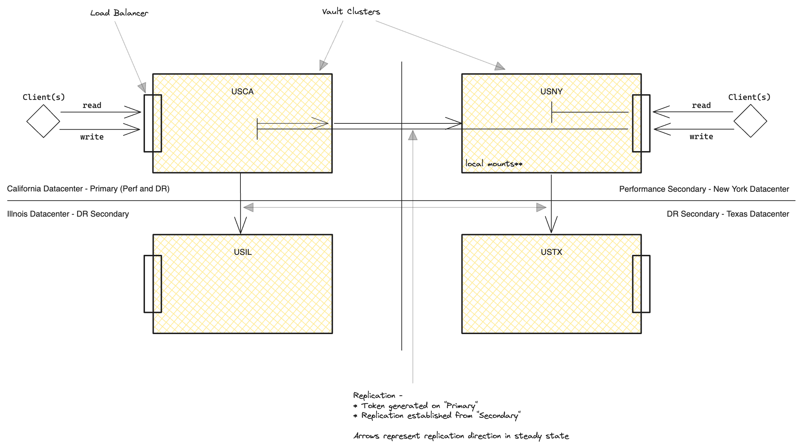

# Vault Compose - Replication

## Usage
```sh
task up
export VAULT_CACERT=$(pwd)/tls/root-ca/dev-root-ca.pem

# primary cluster
task show-ports-lb
export VAULT_ADDR=https://localhost:<vault-lb-usca-443-port-mapping>
export VAULT_TOKEN=$(jq -r .root_token secrets/init.json)
vault operator raft list-peers

# primary cluster - haproxy stats
# browser -> http://localhost:<vault-lb-usca-9000-port-mapping>/stats;up


# do.the.vaulting.


# clean-up
task down
```

## Dependencies
- Docker Compose
- OpenSSL
- Bash
- JQ
- Optional: Taskfile or Make - *NOTE:both use the compose plugin as opposed to the docker-compose standalone binary*

**Taskfile vs Makefile**:
Taskfile is the successor to Make in this repository. Since Make is commonly available by default, it has been left in the repo as-is (for now).

- Taskfile calls role specific scripts - `init-primary.sh`, `init-perf-replica.sh`, `init-dr-secondary.sh`
- Taskfile also orchestrates failover scenarios using - `network-segmentation.sh`
- Makefile uses a single, hardcoded script - `init-steady-state.sh`

## Cluster Topology

Four clusters are deployed:
- **USCA** - San Francisco, CA
- **USNY** - New York, NY
- **USIL** - Chicago, IL
- **USTX** - Austin, TX

### Steady State
- *Primary* - **USCA**
- *Perf Secondary* - **USNY**
- *DR Secondary* - **USIL**
- *DR Secondary [off Perf Secondary]* - **USTX**



### DR Failover
Failover **USCA** to **USIL**

\#TODO
